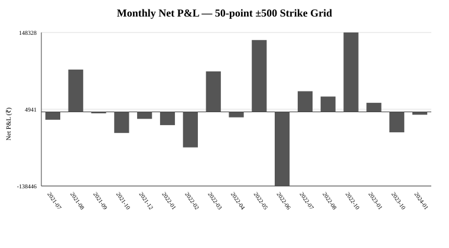
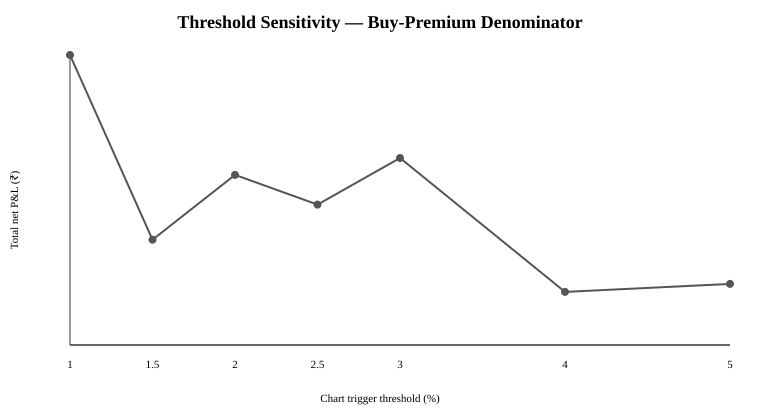
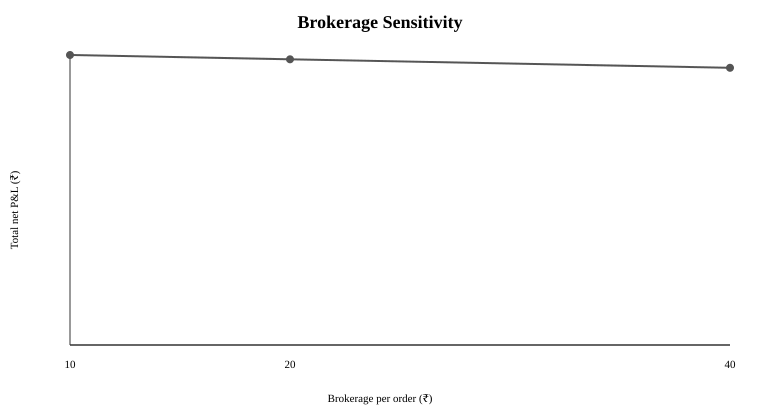
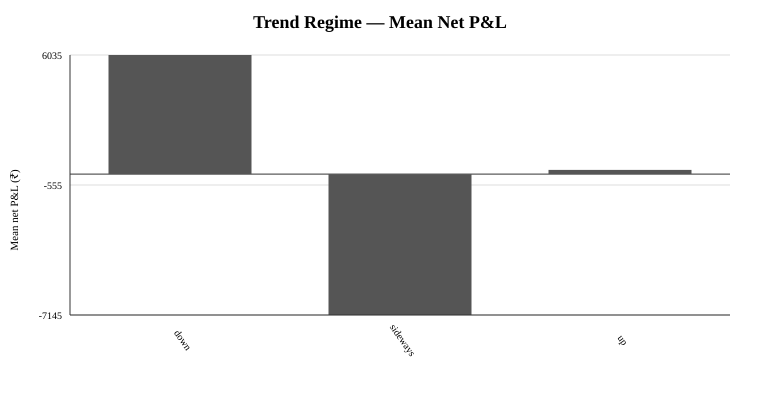
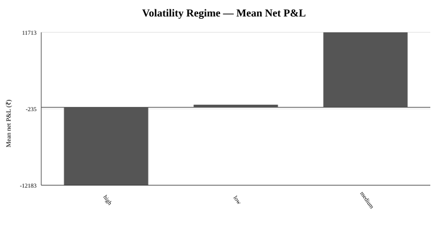
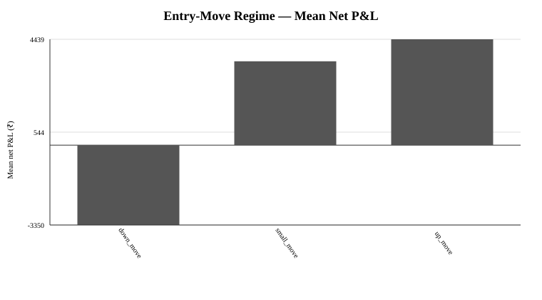

# Research Manuscript — NIFTY Cross-Expiry Payoff-Chart Strategy

## Abstract

This study tests a rule-based NIFTY index-options strategy specified by the user as follows: sell the ATM call and buy the ATM put in the near weekly expiry; buy the ATM call and sell the ATM put in the next weekly expiry; inspect the payoff chart; trade the ATM structure when the chart shows an all-positive flatline greater than 2.5%; otherwise shift the common strike in 50-point increments from -500 through +500 and trade the strikes whose payoff chart exceeds 2.5%; exit at expiry.

The revised backtest explicitly implements the complete 50-point strike grid rather than the earlier incomplete ATM/-400/+400 approximation. Using 09:20 IST close proxies, a buy-premium denominator for the 2.5% chart threshold, 0.25% premium slippage, historical NIFTY lot sizes, and a ₹20-per-order baseline brokerage assumption, the revised implementation generated 63 selected four-leg trades across 52 entry timestamps from 891 eligible entry timestamps. Net P&L was ₹168,665.95, mean trade P&L ₹2,677.24, median ₹6,831.26, win rate 60.32%, profit factor 1.37, and maximum drawdown -₹194,854.37.

The result is economically sensitive to the strategy's exact interpretation. The 2.5% denominator was not explicitly specified by the user and is therefore treated here as a working implementation assumption rather than a confirmed part of the strategy. Under the tested spot-notional denominator, no observations qualified from 1% through 5% thresholds. The positive point estimate also has wide uncertainty: the iid bootstrap 95% interval for mean trade P&L was approximately -₹2,750 to ₹7,903, while the weekly block-bootstrap interval was approximately -₹5,628 to ₹9,958. A chronological 70/30 split was negative in the 45-trade training segment and positive in the 18-trade test segment.

The evidence therefore supports the statement that the clarified rule can be implemented and was historically profitable under one explicit cost-and-denominator specification, but it does not establish a robust, denominator-independent, risk-free arbitrage.

## 1. Strategy Specification

### 1.1 Four option legs

At the entry time:

- Near weekly expiry, common strike K:
  - short one call
  - long one put
- Next weekly expiry, same strike K:
  - long one call
  - short one put

The strike is initially the closest common listed strike to the 09:20 NIFTY spot.

### 1.2 Payoff-chart trigger

The user-defined process is:

1. Check the ATM four-leg payoff chart.
2. If the chart is an all-positive flatline and exceeds 2.5%, trade the ATM structure.
3. If the ATM structure fails, shift the common strike by every 50 points from -500 to +500, excluding ATM.
4. Trade every shifted strike whose payoff chart exceeds 2.5%.
5. Exit at expiry.

The revised implementation does not impose an additional preference order among qualifying fallback strikes. Therefore, multiple fallback strikes can be traded on the same entry timestamp. In the revised sample, 63 trade rows were generated across 52 distinct entry timestamps; 24 were ATM selections and 39 were fallback selections.

### 1.3 Important interpretation of the flatline

For a single hypothetical terminal spot S, the near synthetic short forward contributes K-S and the next synthetic long forward contributes S-K, so the chart is flat. That mathematical flatness results from assigning the same terminal spot to two different expiries.

The actual held position has two settlement states, S1 and S2:

Pi_expiry = (K-S1) + (S2-K) = S2-S1.

Thus the realized strategy is exposed to the movement between the two expiry states. The static all-green chart is not, by itself, proof that the economically held position is riskless.

## 2. Research Questions

1. Does the complete 50-point ±500 strike-selection rule produce positive historical net P&L after transaction costs?
2. How often does the ATM chart qualify, and how often are shifted strikes required?
3. What is the sensitivity of results to the 2.5% trigger threshold, slippage and brokerage?
4. How dependent are results on the denominator used to define the 2.5% chart return?
5. Does the result persist in a chronological holdout period?
6. Are selected outcomes descriptively associated with pre-entry trend, volatility and entry-move regimes?

## 3. Aims and Objectives

The primary aim is to reproduce and empirically test the clarified trading rule without substituting a narrower strike-selection rule.

Objectives are to:

- formalize the payoff algebra;
- implement the full 50-point ±500 strike grid;
- use historical lot sizes rather than one modern lot size;
- model brokerage, exchange fees, SEBI fees, stamp duty, GST, STT, exercise STT and slippage;
- conduct threshold, slippage, denominator and brokerage sensitivity analysis;
- apply chronological validation and block-bootstrap uncertainty analysis;
- attribute outcomes to point-in-time pre-entry market regimes;
- preserve reproducible research artifacts in the Git repository.

## 4. Data

### 4.1 Primary market-data source

The empirical extraction uses the public Hugging Face dataset:

thetrademarkk/india-index-options-1m

The Phase 2/3 pipeline uses NIFTY index data and per-expiry NIFTY option parquet files. Entry is represented by the exact 09:20 IST observation.

The expanded strike-grid extraction generated:

| Data-quality item | Count |
|---|---:|
| Candidate rows generated | 19,341 |
| Complete option/settlement rows | 15,701 |
| Candidate strike unavailable | 3,498 |
| Missing settlement | 142 |
| Lot-mismatch observations excluded from one-for-one P&L | 234 |

The source provides close data rather than historical executable bid/ask quotes. Therefore, 09:20 closes are execution proxies rather than guaranteed fill prices.

### 4.2 Historical lot-size treatment

The research uses an expiry-date-based NIFTY lot calendar:

- 75 before the August 2021 weekly cycle;
- 50 through the April 2024 weekly cycle;
- 25 through the October/November 2024 transition;
- 75 for the subsequent contract cohort;
- 65 from the January 2026 cycle.

Transition observations where near and next contracts have unequal lots are excluded from the one-for-one spread implementation instead of silently forcing equal notional.

## 5. Transaction-Cost Methodology

The baseline cost model uses:

- ₹20 brokerage per executed option order;
- four entry orders per four-leg structure;
- exchange transaction charges represented as a turnover rate;
- SEBI turnover fee;
- buyer-side stamp duty;
- 18% GST on brokerage and exchange/SEBI service charges;
- historical option-sale STT;
- exercise STT applied to long-leg intrinsic value at expiry;
- 0.25% relative premium slippage per leg.

The brokerage input is configurable because broker schedules can vary by time, account cohort and contract-note treatment.

The tested brokerage sensitivity uses ₹10, ₹20 and ₹40 per order.

## 6. P&L Formulae

For entry premiums C1, P1, C2, P2 and settlement states S1 and S2:

Near expiry:

Pi1 = K - S1

Next expiry:

Pi2 = S2 - K

Combined expiry component:

Pi_expiry = S2 - S1

Gross per-unit P&L:

Pi_gross = C1 - P1 - C2 + P2 + S2 - S1

Net P&L:

Pi_net = Pi_gross - transaction costs - execution/slippage effects.

The chart trigger itself is evaluated from observed entry premiums; slippage is applied to realized execution P&L rather than to the signal definition.

## 7. Main Backtest Results

The revised Phase 3 workflow produced the following baseline:

| Metric | Result |
|---|---:|
| Eligible entry timestamps | 891 |
| Selected trade rows | 63 |
| Distinct selected timestamps | 52 |
| ATM trades | 24 |
| Fallback-grid trades | 39 |
| Entry-timestamp selection rate | 5.84% |
| Date range | 2021-07-13 to 2024-01-17 |
| Total net P&L | ₹168,665.95 |
| Mean trade P&L | ₹2,677.24 |
| Median trade P&L | ₹6,831.26 |
| Win rate | 60.32% |
| Profit factor | 1.37 |
| Maximum drawdown | -₹194,854.37 |
| Largest loss | -₹55,420.58 |
| Largest win | ₹35,233.55 |
| Trades/year | 25.07 |

The revised rule begins producing qualified trades earlier than the earlier ATM/-400/+400 implementation because some pre-ATM failures qualify on additional 50-point fallback strikes.

### Figure 1. Monthly net P&L

The distribution is highly uneven. October 2022 contributed ₹148,328.47 and May 2022 contributed ₹134,179.32; together they contributed ₹282,507.80, which is 167.5% of the final net P&L because other months collectively offset part of those gains.

## 8. Strike-Selection Results

The ATM-first portion generated 24 trades and ₹168,709.68 of net P&L.

The 39 fallback trades were distributed across many 50-point shifts. The largest positive fallback contribution came from -300 points, with four trades and ₹72,293.94 net P&L. The largest negative fallback contribution came from +300 points, with five trades and -₹77,954.32 net P&L.

| Shift | Trades | Net P&L |
|---:|---:|---:|
| ATM | 24 | ₹168,709.68 |
| -300 | 4 | ₹72,293.94 |
| +350 | 2 | ₹38,871.32 |
| -350 | 2 | ₹23,932.62 |
| -150 | 2 | ₹20,484.58 |
| -50 | 2 | ₹13,660.01 |
| +150 | 2 | ₹12,980.06 |
| +250 | 1 | ₹7,016.74 |
| +200 | 2 | -₹341.17 |
| -100 | 2 | -₹367.44 |
| +50 | 2 | -₹522.58 |
| -400 | 4 | -₹2,468.71 |
| -500 | 1 | -₹9,755.34 |
| +100 | 2 | -₹10,277.40 |
| -200 | 2 | -₹32,142.74 |
| -450 | 4 | -₹55,453.28 |
| +300 | 5 | -₹77,954.32 |

The fallback grid was used on 28 timestamps, producing 39 trade rows. This confirms that the full-grid interpretation is materially different from limiting the fallback to only ±400.

## 9. Threshold Sensitivity

At 0.25% slippage and the working buy-premium denominator:

| Threshold | Trades | Net P&L | Win rate | Profit factor |
|---:|---:|---:|---:|---:|
| 1.0% | 191 | ₹348,415 | 56.54% | 1.22 |
| 1.5% | 136 | ₹126,478 | 52.21% | 1.11 |
| 2.0% | 94 | ₹204,325 | 52.13% | 1.28 |
| 2.5% | 63 | ₹168,666 | 60.32% | 1.37 |
| 3.0% | 53 | ₹224,638 | 60.38% | 1.57 |
| 4.0% | 18 | ₹63,789 | 77.78% | 1.55 |
| 5.0% | 13 | ₹73,395 | 76.92% | 2.19 |

The relationship is non-monotonic. Increasing the threshold reduces trade count substantially, while the apparent quality of the selected sample varies across thresholds. This sensitivity means a single threshold should not be interpreted as uniquely optimal without an independent validation procedure.

## 10. Denominator Sensitivity

The user specified a 2.5% payoff-chart condition but did not specify the denominator used to calculate the percentage.

The working baseline denominator is the sum of the two long-option premiums:

Base = P1 + C2

The 2.5% trigger is therefore implemented as the observed flatline payoff divided by the long-premium base.

Under the tested alternative spot-notional denominator, no qualifying trades were generated from 1% through 5% thresholds.

This is a major specification uncertainty. The historical performance result is therefore conditional on the working buy-premium interpretation.

## 11. Slippage Sensitivity

At a 2.5% trigger:

| Slippage | Trades | Net P&L | Profit factor |
|---:|---:|---:|---:|
| 0.00% | 63 | ₹174,021 | 1.38 |
| 0.10% | 63 | ₹171,879 | 1.38 |
| 0.25% | 63 | ₹168,666 | 1.37 |
| 0.50% | 63 | ₹163,310 | 1.36 |
| 1.00% | 63 | ₹152,600 | 1.33 |

The signal count is unchanged because slippage is excluded from the trigger calculation. The realized P&L declines as execution quality worsens.

## 12. Brokerage Sensitivity

| Brokerage/order | Net P&L | Mean trade P&L |
|---:|---:|---:|
| ₹10 | ₹171,185.95 | ₹2,717.24 |
| ₹20 | ₹168,665.95 | ₹2,677.24 |
| ₹40 | ₹163,625.95 | ₹2,597.24 |

The historical sign of the result is unchanged across these brokerage assumptions.

## 13. Chronological Validation

The 70/30 chronological split is based on eligible entry timestamps.

| Segment | Trades | Net P&L | Mean | Win rate | Profit factor |
|---|---:|---:|---:|---:|---:|
| Train | 45 | -₹50,828 | -₹1,130 | 55.56% | 0.87 |
| Test | 18 | ₹219,494 | ₹12,194 | 72.22% | 4.05 |

The test segment is materially positive while the earlier training segment is negative. This does not prove persistence; it indicates that performance is time-dependent and that the strategy's outcome cannot be summarized by one full-sample mean alone.

## 14. Uncertainty Analysis

The iid bootstrap 95% interval for mean trade P&L is:

**-₹2,750 to ₹7,903**

The weekly block bootstrap uses 34 weekly blocks and gives:

**-₹5,628 to ₹9,958**

Both intervals include zero. The positive mean is therefore statistically uncertain under these resampling assumptions.

## 15. Benchmark

An unconditional ATM-only baseline across the 891 eligible timestamps had:

- total net P&L: -₹285,676.58
- mean: -₹320.62
- win rate: 51.29%
- profit factor: 0.96
- maximum drawdown: approximately -₹1.186 million

The chart-triggered process therefore filters the candidate set aggressively. This comparison is descriptive and does not by itself establish causal superiority because the signal definition is selective and the denominator remains ambiguous.

## 16. Point-in-Time Regime Attribution

The regime analysis uses only information available by the 09:20 entry.

### 16.1 Trend

| Trend regime | Trades | Mean P&L | Win rate | Profit factor |
|---|---:|---:|---:|---:|
| Down | 33 | ₹6,035 | 63.64% | 1.69 |
| Sideways | 5 | -₹7,145 | 40.00% | 0.32 |
| Up | 25 | ₹209 | 60.00% | 1.05 |

### 16.2 Volatility

| Volatility regime | Trades | Mean P&L | Win rate | Profit factor |
|---|---:|---:|---:|---:|
| High | 12 | -₹12,183 | 33.33% | 0.40 |
| Low | 25 | ₹413 | 64.00% | 1.09 |
| Medium | 26 | ₹11,713 | 69.23% | 4.29 |

### 16.3 Entry move

| Entry-move regime | Trades | Mean P&L | Win rate | Profit factor |
|---|---:|---:|---:|---:|
| Down move | 12 | -₹3,350 | 50.00% | 0.72 |
| Small move | 19 | ₹3,517 | 57.89% | 1.58 |
| Up move | 32 | ₹4,439 | 65.63% | 1.72 |

These are descriptive regime associations. They are not additional trading rules and were not used to select the 63 trades.

## 17. Discussion

The corrected strike-grid implementation materially changes the characterization of the strategy.

First, the fallback mechanism is not a minor ±400 adjustment. Under the clarified specification, the algorithm can select a wide range of strikes and can select multiple fallback strikes on the same timestamp. In this sample, 39 of 63 trades came from fallback strikes.

Second, the full-grid sample is still positive in total, but its risk characteristics are materially weaker than the earlier incomplete implementation. Profit factor is 1.37, maximum drawdown is approximately ₹194,854, and the iid and block-bootstrap intervals both include zero.

Third, the time pattern is uneven. The chronological training segment is negative while the later test segment is strongly positive. This is evidence of regime or period dependence, not evidence of a stable universal edge.

Fourth, the denominator problem is central. A different denominator can eliminate the signal completely. The empirical conclusion therefore cannot be separated from how the user interface defines the 2.5% chart percentage.

Fifth, the flatline chart remains mathematically valid as a single-spot illustration but not as a complete economic payoff. The held position is a cross-expiry synthetic spread with S2-S1 exposure.

## 18. Strengths

1. The full user-provided strike grid is now represented exactly as a 50-point ±500 search.
2. Multiple qualifying fallback strikes are retained rather than silently ranked.
3. Historical lot sizes are handled by expiry.
4. Brokerage, exchange charges, SEBI fees, stamp duty, GST, STT, exercise STT and slippage are included.
5. The 2.5% denominator is explicitly exposed rather than hidden.
6. Chronological validation and block bootstrap are included.
7. Point-in-time regime variables avoid same-day end-of-day look-ahead.
8. All research steps, failures and workflow artifacts are retained in GitHub.

## 19. Limitations

1. Historical bid/ask quote data is unavailable in the primary source, so 09:20 closes are execution proxies.
2. Exchange settlement prices are proxied using the final index bar of the expiry day.
3. The 2.5% denominator remains unspecified by the original strategy description.
4. The selection sample is small relative to the available 891 timestamps.
5. Performance is strongly time-dependent and concentrated in a subset of months.
6. The fallback grid can produce multiple simultaneous trades, increasing capital and execution requirements.
7. Far/illiquid option coverage can be incomplete in the public source.
8. Cross-market variables such as India VIX, FII/DII flows, full option IV surfaces, USD/INR, gold and global equity benchmarks were not integrated into this final empirical rerun.
9. Broker-specific historical pricing should ultimately be reconciled to actual contract notes.
10. Larger position sizes and market impact were not modeled.

## 20. Conclusion

The clarified strategy has now been backtested with the full 50-point strike grid from -500 to +500 rather than the earlier ATM/-400/+400 approximation.

Under the working buy-premium denominator, 0.25% slippage and ₹20/order baseline brokerage, the implementation produced ₹168,665.95 of historical net P&L across 63 trade rows and 52 entry timestamps.

This result is **not sufficient to characterize the strategy as a robust or risk-free arbitrage**. The main reasons are the unresolved percentage denominator, broad uncertainty intervals, substantial drawdown, time dependence, sparse trade count, execution-data limitations, and the fact that multiple fallback strikes may be traded simultaneously.

The most defensible conclusion is that the clarified rule is reproducible and had a positive historical point estimate under one explicit implementation, but further quote-level, settlement-level and out-of-sample validation is required before interpreting that result as persistent strategy performance.

## 21. Future Research

### Phase A — Recover the exact chart-percentage definition

Identify the exact payoff-chart software/interface and its denominator. Re-run the full study with that definition as the primary specification.

### Phase B — Quote-level execution

Obtain historical bid/ask or tick data around 09:20 for all four legs. Replace close-proxy fills with bid/ask-aware execution.

### Phase C — Official settlement

Replace the final-index-bar settlement proxy with official exchange settlement fields.

### Phase D — Cross-market and sentiment variables

Merge point-in-time India VIX, FII/DII activity, option open interest and IV surface data, USD/INR, gold and major global equity benchmarks.

### Phase E — Independent validation

Use a completely untouched period not used for threshold/specification development and apply multiple-testing controls to the strike/threshold/denominator grid.

### Phase F — Capital and execution constraints

Model simultaneous fallback positions, margin, broker limits, market impact and realistic portfolio-level capital allocation.

## 22. Reproducibility Appendix

Key corrected workflow runs:

- Phase 2 data source: **36255238050**
- Corrected full 50-point-grid Phase 3 backtest: **36262958536**
- Corrected full-grid Phase 4 validation: **36263760476**
- Corrected full-grid Phase 5 regime attribution: **36263974629**

Corrected result snapshots:

- results/phase3_grid_summary.json
- results/phase4_grid_validation_summary.json
- results/phase4_grid_robustness.csv
- results/phase4_grid_brokerage_sensitivity.csv
- results/phase5_grid_regime_summary.csv

Corrected figures:

- docs/figures/grid_monthly_pnl.svg
- docs/figures/grid_threshold_sensitivity.svg
- docs/figures/grid_brokerage_sensitivity.svg
- docs/figures/grid_trend_regime.svg
- docs/figures/grid_vol_regime.svg
- docs/figures/grid_entry_move_regime.svg

## References

1. Vipul (2008). Cross-market efficiency in the Indian derivatives market: A test of put-call parity. *Journal of Futures Markets*, 28(9), 889–910. DOI: 10.1002/fut.20325.
2. Mohanti & Priyan (2015). An Empirical Test of Cross-Market Efficiency of Indian Index Options Market Using Put-Call Parity Condition.
3. Azzone & Baviera (2020). Synthetic forwards and cost of funding in the equity derivative market. arXiv:2011.03795.
4. Nisbet (1992). Put-call parity theory and an empirical test of the efficiency of the London Traded Options Market. *Journal of Banking & Finance*, 16(2), 381–403.
5. Shin (2026). The P behind Q: Empirical Evidence from Physical Drift in Put-Call Parity. SSRN 6762800.
6. Wilkens (2026). Here Today, Gone Today: First Evidence on European Zero-Day Options. SSRN 7094758.
7. NSE India. Securities Transaction Tax — Equity Derivatives.
8. NSE India. Historical Data — India VIX.
9. NSE India. All Reports — Derivatives.
10. NSE India. FII/FPI & DII trading activity.
11. Paytm Money. F&O FAQs.
12. Paytm Money. Historical brokerage notice.

## Supplement A — Interpretation of the Green Flatline

A positive flatline on a chart generated by assigning a single terminal spot to both expiries is an algebraic property of the synthetic-forward pair. It is not equivalent to saying that the realized two-expiry position has a flat terminal P&L. The economic terminal term is S2-S1.

## Supplement B — Working Trigger Definition

The current empirical implementation defines the working trigger as:

100 × (C1 - P1 - C2 + P2) / (P1 + C2) > 2.5%

This is an implementation assumption because the user did not specify the denominator. The trigger is calculated from observed entry prices; transaction-cost and slippage effects are incorporated into realized P&L.

## Supplement C — Full Strike Grid

The fallback candidate shifts are:

-500, -450, -400, -350, -300, -250, -200, -150, -100, -50, +50, +100, +150, +200, +250, +300, +350, +400, +450, +500.

ATM is tested first. Fallbacks are evaluated only when ATM fails. Every fallback satisfying the trigger is retained.

## Phase 7 addendum — payoff-platform semantics and exhaustive maximum-value selection

### Strategy specification change

Phase 7 replaced the superseded ordered ATM/fallback rule with an exhaustive candidate search. For every 09:20 IST entry timestamp, all common strikes from ATM-400 through ATM+400 in 50-point increments are evaluated. The candidate is first required to exceed the 2.5% chart-percentage gate. Among eligible candidates, the primary selector is the maximum estimated equal max-profit=max-loss flatline value in INR. A separate maximum-percentage selector is retained as a sensitivity.

The displayed percentage itself is not claimed to be an exact Sensibull reconstruction. Sensibull's public documentation defines the percentage denominator as margin required, whereas the historical cached dataset does not contain the historical margin requirement for each position. The repository therefore uses its legacy buy-premium denominator only as an explicit proxy for the 2.5% gate.

### Phase 7 data and execution

The empirical rerun used the cached Phase 3 expanded strategy-input artifact rather than downloading new market data. The analysis was independently checked with a raw Parquet reader because the local environment did not expose a usable Parquet engine. The reader reproduced the prior authoritative 63-trade result exactly before evaluating the new selector.

Execution assumptions remained 0.25% premium slippage per leg, ₹20 brokerage per executed order, dated statutory charges from the repository cost model, historical lot sizes, 09:20 option close as the execution proxy, and expiry settlement.

### Phase 7 results

The requested exhaustive grid contained 13,824 complete candidate rows across 905 timestamps. Forty-eight timestamps had at least one candidate above the 2.5% proxy gate, and one candidate was selected at each such timestamp.

At 0.25% slippage:

- 48 selected trades;
- total net P&L ₹166,866.51;
- mean trade P&L ₹3,476.39;
- median trade P&L ₹6,242.51;
- win rate 60.42%;
- profit factor 1.56;
- maximum drawdown -₹124,060.72;
- largest loss -₹55,321.89;
- largest win ₹35,233.55.

### Economic decomposition

The static same-terminal-spot chart component contributed ₹36,138.75 across the selected trades. The realized cross-expiry settlement component `(S2-S1)` contributed ₹142,545.00 before entry slippage and fees. This decomposition is consistent with the independent payoff identity:

`economic P&L = static chart value + (S2-S1) - execution/cost adjustments`.

Among the 19 losing trades, the static chart component contributed +₹13,681.25 in aggregate, while the `S2-S1` component contributed -₹309,305.00. All 19 losses were already negative before modeled fees, and no loss was caused solely by fees.

### Robustness

The iid 95% bootstrap confidence interval for mean trade P&L was -₹1,943.61 to ₹8,927.91; the weekly block-bootstrap interval was -₹3,672.56 to ₹9,932.60. The chronological 70/30 split produced +₹18,711.33 in training and +₹148,155.17 in the later test segment. These results remain sensitive to chronology and do not independently establish a stable edge.

Net P&L under 0%, 0.25%, 0.50% and 1.00% premium slippage was ₹171,346.72, ₹166,866.51, ₹162,386.29 and ₹153,425.87 respectively.

### Regime observations

Descriptively, medium-volatility observations produced the strongest subgroup results (21 trades; mean net P&L ₹11,658.63; profit factor 4.27), while high-volatility observations were negative on average (9 trades; mean -₹7,806.15; profit factor 0.48). Down-trend observations were also positive on average (25 trades; mean ₹7,760.37). These are exploratory subgroup findings and were not used to select trades.

### Phase 7 inference

The new selection rule has a positive historical point estimate under the stated proxy and execution assumptions, but the payoff graph itself is not the economic source of the result. The dominant realized contribution is the movement between the two expiries. The statistical uncertainty intervals include zero, and the result is concentrated in particular periods and regimes.

The unresolved item is the exact historical margin-required denominator used by the user's chart. Until that denominator is reconstructed or the original platform can be replicated directly, the 2.5% gate should be treated as a proxy rather than an exact reproduction of the displayed percentage.

## Phase 7A — exact historical margin-denominator result

### Objective

The 2.5% threshold was redefined from the earlier buy-premium proxy to the platform-style percentage using margin required. The screenshot calibration and historical SPAN archive coverage were then used to reconstruct the denominator for every candidate capable of exceeding 2.5%.

### Methodological correction

The strategy grid is strictly ATM-400 through ATM+400 in 50-point increments. An earlier intermediate exact-margin artifact allowed ±500 because the cached Phase 3 dataset was wider; those extra candidates were removed before the final result. The exact historical workflow now enforces ±400.

For the two short NIFTY index-option legs, the calibrated/documented index-option ELM rate of 2% per short leg supplies a 4% spot-notional lower bound before SPAN scan risk. Therefore candidates that cannot exceed 2.5% against this lower bound cannot reach 2.5% of actual margin required and can be safely excluded from expensive exact SPAN reconstruction.

### Historical denominator calibration

The user's screenshot showed ₹88,076 standalone margin. The exact four-leg position reconstructed from NSE/NSCCL SPAN produced ₹87,812.40 at the closest same-day intraday revision, a 0.2993% discrepancy. This calibrates the historical denominator to margin required.

### Exact result

Using the i1 begin-day SPAN snapshot as the no-look-ahead primary denominator, four timestamps pass the 2.5% gate:

- 2021-08-04, shift +100, max-profit % 4.5728%, net P&L ₹5,609.49.
- 2022-04-04, shift +300, max-profit % 5.1319%, net P&L -₹5,791.42.
- 2022-05-25, shift -250, max-profit % 2.6441%, net P&L ₹23,853.19.
- 2022-06-30, shift -400, max-profit % 2.6564%, net P&L ₹19,008.91.

Aggregate:

- 4 trades;
- net P&L ₹42,680.17;
- mean ₹10,670.04;
- median ₹12,309.20;
- win rate 75%;
- profit factor 8.37;
- maximum drawdown -₹5,791.42;
- modeled costs ₹647.48.

Maximum estimated INR flatline-value selection and maximum margin-based percentage selection are identical on all four qualifying timestamps.

### Sensitivity to the settlement-file SPAN snapshot

Using the settlement/sensitivity SPAN file gives three qualifying timestamps and ₹23,671.26 net P&L. The selected shifts are +100, +300 and -250.

### Interpretation

The earlier 48-trade/₹166,866.51 result should not be used as the primary estimate of the user's stated 2.5% rule because it used the buy-premium proxy. Under the reconstructed margin denominator and the user's current ±400 strike range, the historical sample is only four primary trades.

The small sample precludes a meaningful claim of statistical robustness. The exact reconstruction is useful because it resolves the denominator and selection mechanics; it does not establish that the strategy has a persistent trading edge.

### Reproducibility

Exact trade ledger: `results/phase7a/exact_margin_selected_i1.csv`

Sensitivity ledger: `results/phase7a/exact_margin_selected_s.csv`

Summary: `results/phase7a/exact_margin_summary.json`

Historical SPAN coverage: `results/phase7a/span_coverage_summary.json`
