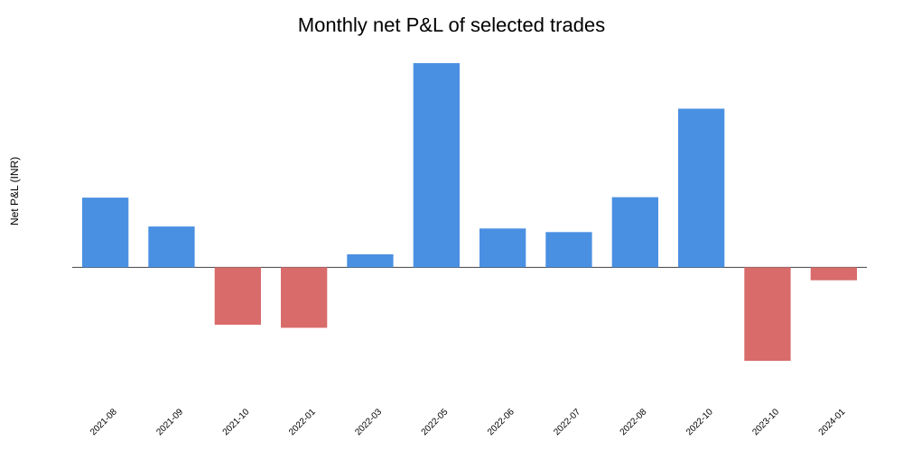
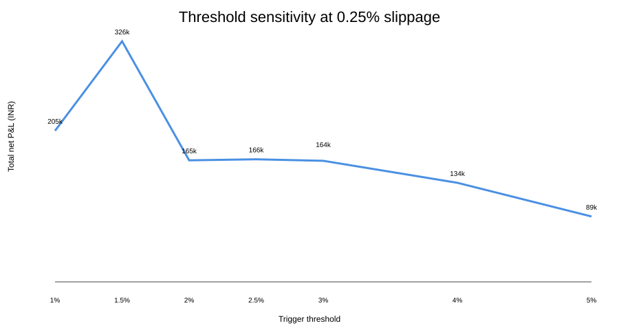
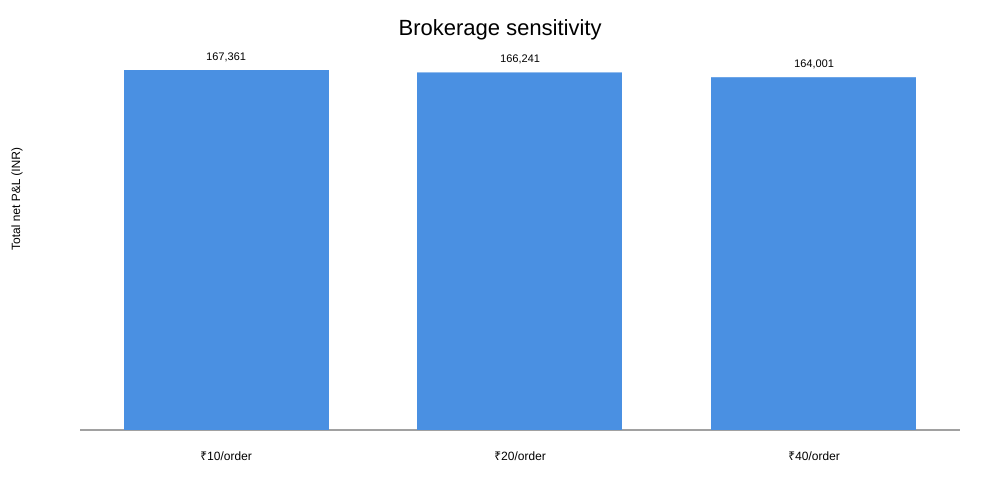
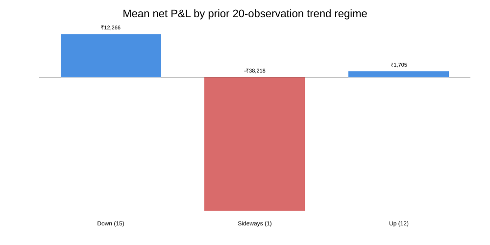
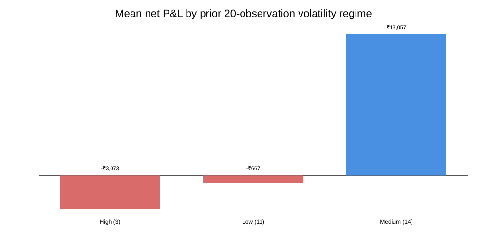
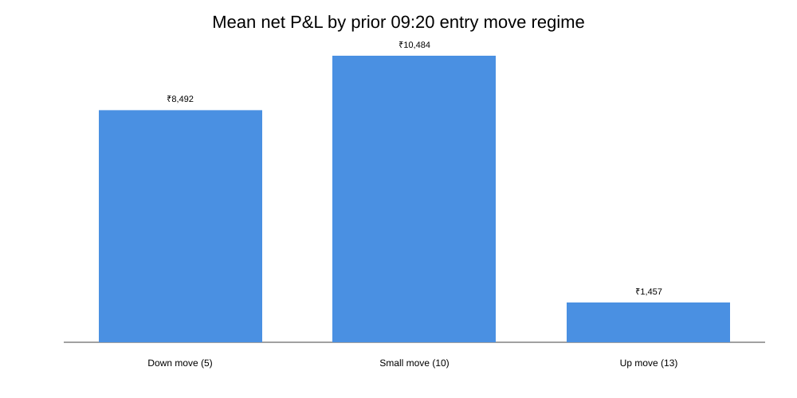

> **Specification-status correction (2026-09-26):** The earlier Phase 3 implementation described a 28-trade subset as “selected trades.” Code audit shows that subset was created by an assistant-imposed operational gate: ATM first, then ATM-400/ATM+400, requiring the coded chart metric to exceed 2.5% under a buy-premium denominator. The user has clarified that no separate trade-selection criterion was supplied. Therefore, the 28-trade results in this manuscript are **provisional implementation results, not final evidence for the user's strategy**. No final strategy conclusion should be drawn from them until the entry/selection semantics and the 2.5% denominator are explicitly specified.

# Cross-Expiry NIFTY Synthetic-Forward Strategy: Empirical Backtest, Robustness and Point-in-Time Regime Analysis

## Abstract

This study evaluates a four-leg weekly NIFTY index-options strategy defined as: (i) short an at-the-money (ATM) call and long an ATM put in the near weekly expiry, combined with (ii) long an ATM call and short an ATM put in the next weekly expiry; (iii) trade only when the user's payoff-chart trigger exceeds 2.5%; and (iv) when ATM fails, test a common strike shifted by -400 and +400 NIFTY points.

The analytical specification shows that the near-expiry legs form a short synthetic forward while the next-expiry legs form a long synthetic forward. Consequently, a one-dimensional payoff chart that applies the same terminal spot to both expiries can show a flat line even though the actual held-to-expiry position contains cross-expiry settlement risk. The correct expiry component is the next-expiry settlement minus the near-expiry settlement, plus the observed entry premium edge and transaction costs.

A reproducible historical pipeline was executed on a public 1-minute NIFTY index/options dataset covering 2021-06-01 to 2026-08-31. Because the source does not provide bid/ask quote history, 09:20 IST close is used as a price proxy and a 0.25% per-premium-leg slippage assumption is applied to realized execution. Historical NIFTY lot sizes are handled by expiry date and unequal-lot near/next pairs are excluded from the one-for-one synthetic-forward sample.

Under the primary, explicitly configurable interpretation of the user's 2.5% trigger—buy-premium denominator, 0.25% slippage, and a ₹20 brokerage assumption per executed order—the signal selected 28 trades from 891 eligible entry timestamps. The selected trades produced ₹166,241 net P&L, mean ₹5,937 per trade, median ₹9,431, a 67.9% win rate, profit factor 2.33, and maximum cumulative drawdown of approximately ₹48,161. The 95% iid bootstrap interval for mean trade P&L was approximately -₹434 to ₹11,735; a block bootstrap using weekly blocks gave approximately -₹1,689 to ₹12,745. The chronological 70/30 split produced 19 training trades with ₹92,253 net P&L and 9 test trades with ₹73,988 net P&L.

The result is therefore historically positive in the tested implementation, but uncertainty remains substantial. The signal is sparse, concentrated in 2021-2024 despite a wider source-data window, and 89.3% of total selected-trade P&L came from two months (May and October 2022). The outcome is also sensitive to the unresolved denominator in the original 2.5% rule: using buy-premium produces trades, whereas the evaluated spot-notional denominator produced zero qualifying trades across thresholds from 1% to 5%. Configured-capital sensitivity was not run because the required capital figure was not supplied.

Point-in-time spot-derived regime attribution found higher average trade P&L in prior down-trend and medium-volatility regimes, while high-volatility regimes had negative aggregate P&L. These regime results are descriptive and based on small samples. Cross-market FII/DII, India VIX, FX, gold, global-equity and historical option-IV attribution remains a documented extension rather than an invented result.

**Keywords:** NIFTY options, synthetic forward, put-call parity, cross-expiry, transaction costs, slippage, backtest, regime analysis, India VIX, FII/DII.

## 1. Introduction

Synthetic-forward relationships arise directly from put-call parity. For a common strike K, a long call plus short put approximates a long forward, while short call plus long put approximates a short forward. The strategy examined here combines those two constructions across adjacent weekly expiries.

The intuitive appeal of the original payoff chart is that one synthetic-forward payoff is the negative of the other when the same terminal spot is used. That construction creates an apparently flat line. However, the two option packages do not settle at the same date. The economically relevant terminal values are therefore tied to two different settlement levels.

For the near expiry:

- -max(S1-K, 0) + max(K-S1, 0) = K-S1.

For the next expiry:

- +max(S2-K, 0) - max(K-S2, 0) = S2-K.

Summing them gives:

- (K-S1) + (S2-K) = S2-S1.

With entry cashflow per unit

- E = C1-P1-C2+P2,

the gross per-unit expiry P&L is:

- Pi_gross = E + S2-S1.

This identity is the central analytical control used throughout the research.

## 2. Research Questions and Hypotheses

### RQ1
Does the specified chart-triggered cross-expiry strategy generate positive net P&L after explicit brokerage, statutory charges, slippage and expiry exercise costs?

### RQ2
Does the user's >2.5% payoff-chart trigger select outcomes that differ from the unconditional ATM strategy?

### RQ3
What happens when the common strike is shifted by -400 or +400 points after ATM fails the trigger?

### RQ4
How does performance vary across point-in-time trend, volatility and entry-move regimes?

### RQ5
Can the apparent result be explained by execution assumptions, data artifacts, expiry settlement proxies or denominator choice?

The predeclared research hypothesis was that the strategy would only be treated as empirically supported if positive performance survived realistic cost assumptions, chronological validation and robustness analysis.

## 3. Literature Review

The literature motivating the study falls into four related areas.

1. **Put-call parity and cross-market efficiency.** Vipul (2008) tests put-call parity in the Indian derivatives market and demonstrates that observed relationships must be evaluated using market frictions rather than frictionless equality alone. Mohanti and Priyan (2015) similarly examine cross-market efficiency using put-call parity.

2. **Synthetic forwards and funding/transaction costs.** Azzone and Baviera (2020) show how apparent synthetic-forward discrepancies interact with funding and market frictions. This is directly relevant because the strategy combines synthetic forwards at different maturities.

3. **Historical option-market efficiency.** Earlier international work, including Nisbet (1992), documents the importance of execution and market-structure frictions when testing parity-based relationships.

4. **Recent work on short-dated options and physical drift.** Recent papers such as Shin (2026) and Wilkens (2026) reinforce the importance of treating very short-dated option observations and parity deviations as empirical market-structure questions rather than frictionless arbitrage identities.

The research design therefore treats the flat payoff chart as a signal candidate, not as evidence of a risk-free trade.

## 4. Data

### 4.1 Primary dataset

The primary source was the public Hugging Face dataset thetrademarkk/india-index-options-1m, containing 1-minute NIFTY index/option observations and fields including timestamp, strike, option type, expiry, volume and open interest. The dataset itself documents incomplete coverage for illiquid/far strikes and recommends exchange cross-checks.

### 4.2 Entry rule

The base observation is 09:20 IST. At that time the pipeline identifies the nearest two valid weekly expiries and common strikes, then evaluates:

- ATM
- ATM - 400
- ATM + 400

The ATM strike is the common strike closest to spot. The -400/+400 candidates are tested only as fallbacks after the ATM candidate fails the trigger.

### 4.3 Settlement proxy

For the empirical pipeline, the last available 1-minute NIFTY index observation on each expiry date is used as the settlement proxy. This is not treated as identical to an exchange-published settlement price; the distinction is a limitation.

### 4.4 Historical lot sizes

The backtest uses an expiry-specific NIFTY lot calendar:

- before 2021-08-01: 75
- 2021-08-01 through 2024-05-01: 50
- 2024-05-02 through 2024-11-20: 25
- 2024-11-21 through 2026-01-05: 75
- from 2026-01-06: 65

Near/next pairs with unequal lot sizes are excluded from the one-for-one synthetic-forward sample.

### 4.5 Execution limitation

Bid/ask quotes are absent from the primary dataset. The research therefore uses 09:20 close prices as a proxy and applies slippage sensitivity at 0%, 0.10%, 0.25%, 0.50% and 1.00% of each option premium.

## 5. Transaction-Cost Methodology

The cost model includes:

- four option-order brokerage
- exchange transaction charges
- SEBI turnover fee
- stamp duty
- GST on applicable brokerage/exchange/SEBI components
- STT on option sales
- STT on exercised long options
- configurable slippage

The model uses a ₹20/order baseline for the primary historical run and separately reports ₹10, ₹20 and ₹40 per-order sensitivity.

NSE's current published STT schedule lists 0.15% on option sales from 1 April 2026, and 0.15% on option sales where exercised, with the taxable value based on premium and intrinsic value respectively. The model therefore includes both sale STT and long-leg exercise STT.

Paytm Money's current public F&O FAQ states ₹10 brokerage per unique executed F&O order. Paytm Money's historical published material also documents that older customer cohorts could retain different rates and that new customers from 25 August 2023 were charged ₹20 per executed F&O order. The research therefore keeps brokerage configurable rather than pretending that a single rate is valid for every historical account.

## 6. Statistical Analysis Plan

Primary outcome measures:

- total net P&L
- mean and median trade P&L
- win rate
- profit factor
- maximum cumulative drawdown
- monthly positive-P&L frequency
- largest loss and largest gain
- trades per year

Uncertainty analyses:

1. iid bootstrap confidence interval for mean trade P&L
2. weekly block bootstrap
3. chronological 70/30 walk-forward split
4. slippage sensitivity
5. threshold sensitivity
6. denominator sensitivity
7. ATM versus fallback strike selection
8. brokerage sensitivity
9. data-quality and lot-transition sensitivity

The block bootstrap is emphasized because individual trades are time-series observations and cannot safely be treated as iid.

## 7. Primary Backtest Results

### Table 1. Baseline selected-trade performance

| Metric | Result |
|---|---:|
| Eligible entry timestamps | 891 |
| Selected trades | 28 |
| Selection rate | 3.14% |
| Selection period | 2021-08-05 to 2024-01-17 |
| Net P&L | ₹166,240.97 |
| Mean trade P&L | ₹5,937.18 |
| Median trade P&L | ₹9,431.27 |
| Win rate | 67.86% |
| Profit factor | 2.33 |
| Max drawdown | -₹48,161.45 |
| Largest loss | -₹38,217.71 |
| Largest gain | ₹33,479.60 |
| Trades/year | 11.43 |

The selected-trade result is positive in the tested implementation, but the trade count is small relative to the 891 eligible timestamps.

### Figure 1. Monthly P&L

Two months—May 2022 and October 2022—contributed ₹148,375.79, or approximately 89.3% of total selected-trade net P&L. This is a concentration warning rather than a causal explanation.

## 8. Baseline Comparison

The unconditional ATM baseline across 891 eligible entry timestamps had:

- net P&L: -₹285,676.58
- mean P&L: -₹320.62
- median P&L: ₹656.24
- win rate: 51.29%
- profit factor: 0.961
- max drawdown: approximately -₹1.186 million

The chart-triggered selection therefore filters the unconditional candidate set very aggressively. The observed difference is descriptive; it does not establish that the trigger is causally responsible because signal construction, denominator choice and sample sparsity remain important.

## 9. Strike-Selection Results

Of the 28 selected trades:

| Selection | Trades | Total net P&L |
|---|---:|---:|
| ATM | 24 | ₹168,709.68 |
| ATM - 400 | 4 | -₹2,468.71 |
| ATM + 400 | 0 | ₹0.00 |

The fallback rule was therefore rarely used. The ATM-minus-400 fallback had negative aggregate P&L in this sample, while no ATM-plus-400 trade qualified after the ATM-first selection rule.

## 10. Threshold Sensitivity

At 0.25% slippage and the buy-premium denominator:

| Threshold | Trades | Total net P&L | Win rate |
|---:|---:|---:|---:|
| 1.0% | 60 | ₹204,970 | 58.3% |
| 1.5% | 47 | ₹326,358 | 66.0% |
| 2.0% | 37 | ₹164,814 | 62.2% |
| 2.5% | 28 | ₹166,241 | 67.9% |
| 3.0% | 21 | ₹164,171 | 81.0% |
| 4.0% | 11 | ₹134,355 | 100.0% |
| 5.0% | 7 | ₹88,639 | 100.0% |

The relationship is non-monotonic. Higher thresholds reduce the trade count sharply; the 100% win rates at 4% and 5% are based on only 11 and 7 trades and should not be interpreted as evidence of certainty.

## 11. Denominator Sensitivity

The original 2.5% denominator is not specified.

The primary buy-premium denominator generated the 28 baseline trades. Under the evaluated spot-notional denominator, no qualifying trades occurred across 1%, 1.5%, 2%, 2.5%, 3%, 4% or 5% thresholds at 0.25% slippage.

This is a first-order specification issue: the denominator materially changes whether the rule trades at all. The configured-capital denominator remains unevaluated because no capital amount was supplied.

## 12. Slippage and Brokerage Sensitivity

At the 2.5% buy-premium trigger:

| Slippage | Trades | Net P&L |
|---:|---:|---:|
| 0.00% | 28 | ₹168,148 |
| 0.10% | 28 | ₹167,385 |
| 0.25% | 28 | ₹166,241 |
| 0.50% | 28 | ₹164,334 |
| 1.00% | 28 | ₹160,520 |

The trigger itself is defined from observed premiums; slippage is applied to realized execution rather than to the signal definition.

### Brokerage sensitivity

| Brokerage/order | Net P&L |
|---:|---:|
| ₹10 | ₹167,361 |
| ₹20 | ₹166,241 |
| ₹40 | ₹164,001 |

Brokerage alone does not explain the sign of the backtest result under these three sensitivity cases.

## 13. Walk-Forward Validation

The chronological split occurs at 2022-07-07.

| Period | Trades | Net P&L | Mean | Win rate | Profit factor |
|---|---:|---:|---:|---:|---:|
| Train | 19 | ₹92,253 | ₹4,855 | 68.4% | 2.28 |
| Test | 9 | ₹73,988 | ₹8,221 | 66.7% | 2.39 |

The untouched test segment is positive in this implementation. However, only nine trades fall into the test set, so the result remains statistically fragile.

## 14. Uncertainty

The iid bootstrap 95% confidence interval for mean trade P&L is approximately:

-₹434 to ₹11,735.

The weekly block bootstrap gives approximately:

-₹1,689 to ₹12,745.

Both intervals include zero. This means the positive point estimate should be interpreted as uncertain rather than as a statistically established non-zero expectation.

## 15. Point-in-Time Regime Attribution

The regime extension uses only information observable by the 09:20 entry:

- prior 20-observation trend
- prior 20-observation annualized volatility
- prior 09:20 entry move

No same-day end-of-day information is used.

### Trend regime

| Regime | Trades | Mean P&L | Win rate |
|---|---:|---:|---:|
| Down | 15 | ₹12,266 | 73.3% |
| Sideways | 1 | -₹38,218 | 0.0% |
| Up | 12 | ₹1,705 | 66.7% |

### Volatility regime

| Regime | Trades | Mean P&L | Win rate |
|---|---:|---:|---:|
| High | 3 | -₹3,073 | 33.3% |
| Low | 11 | -₹667 | 63.6% |
| Medium | 14 | ₹13,057 | 78.6% |

### Entry-move regime

| Regime | Trades | Mean P&L | Win rate |
|---|---:|---:|---:|
| Down move | 5 | ₹8,492 | 60.0% |
| Small move | 10 | ₹10,484 | 80.0% |
| Up move | 13 | ₹1,457 | 61.5% |

These results are descriptive. The regime buckets have small sample sizes and were not used to create a new trading rule within this research phase.

## 16. Discussion

### 16.1 What the results do show

The backtest demonstrates that the user's chart trigger can be translated into a reproducible signal and that, under one explicit denominator interpretation, it selected a small subset of observations with positive historical net P&L.

The selected result remains positive under the tested 0% to 1% slippage range and under ₹10 to ₹40 brokerage sensitivity. The chronological 70/30 split is also positive in the nine-trade test segment.

The result is therefore not an artifact of a single exact cost point.

### 16.2 What the results do not show

The research does not demonstrate a risk-free arbitrage. It does not demonstrate that the strategy has a stable positive expectancy outside the observed sample. It does not demonstrate that a flat chart is economically flat. It does not establish a unique denominator for the 2.5% rule.

The confidence intervals include zero, the test sample is only nine trades, and two months account for roughly 89% of total selected-trade P&L.

### 16.3 Why the flatline remains misleading

The flatline is a consequence of replacing two terminal states S1 and S2 with one common hypothetical terminal spot. That replacement destroys the very cross-expiry risk that the empirical backtest measures. The correct terminal term is S2-S1.

### 16.4 Role of execution friction

Put-call parity relationships are often discussed in frictionless form. The present empirical implementation shows why execution details must be explicit:

- option quotes are not directly executable at the midpoint/close;
- four option orders produce multiple brokerage/fee events;
- STT changes over time;
- long-leg exercise can create additional STT;
- historical lot sizes change;
- settlement-price conventions differ from a simple final intraday close.

The research therefore treats the positive point estimate as conditional on a deliberately stated execution model.

## 17. Strengths

1. The strategy was formalized algebraically before backtesting.
2. The flat-chart issue was separated from the actual cross-expiry settlement P&L.
3. Historical lot-size changes were explicitly handled.
4. Transaction costs, slippage, STT, brokerage and exercise costs were modeled.
5. The signal denominator was kept configurable instead of silently chosen.
6. Chronological out-of-sample validation and block bootstrap were added.
7. Point-in-time regime construction avoids same-day end-of-day look-ahead.
8. The research repository preserves reproducible workflow artifacts, error logs and result snapshots.

## 18. Limitations

1. The primary option dataset does not provide bid/ask quotes; 09:20 close is only a proxy.
2. The empirical settlement proxy is the last index bar on expiry day rather than a separately validated exchange settlement field.
3. The selected signal generated only 28 trades and none after 2024-01-17 in the tested selection sample despite source data extending later.
4. Two months account for roughly 89% of selected-trade total net P&L.
5. Bootstrap and walk-forward estimates have low effective sample sizes.
6. The exact denominator in the original 2.5% rule remains unknown.
7. Cross-market variables such as India VIX, FII/DII flows, USD/INR, gold, global equity and option-IV term structure were documented as required sources but were not merged into the final attribution table in this phase.
8. Historical Paytm Money brokerage is account/cohort dependent; contract-note reconciliation is required for broker-specific conclusions.
9. The research does not include market-impact modeling for larger-than-one-lot size.
10. The data source itself warns that far/illiquid strike coverage can be incomplete.

## 19. Conclusion

In the tested implementation, the cross-expiry NIFTY synthetic-forward strategy combined with the >2.5% chart trigger produced positive historical net P&L under a buy-premium denominator, 0.25% slippage and a ₹20/order baseline brokerage assumption.

The result should be interpreted as historical empirical evidence, not a trading guarantee. The strongest caveats are the unresolved denominator, sparse 28-trade sample, concentration of P&L in a small number of months, broad uncertainty intervals, close-based execution proxy, and incomplete cross-market attribution.

The most defensible research conclusion is therefore:

> The specified rule is reproducible and historically positive in the tested cost-aware sample, but the evidence is not yet strong enough to treat the strategy as a robust, denominator-independent or risk-free arbitrage.

The flatline payoff chart should not be used as the economic payoff representation. The appropriate representation is the cross-expiry settlement term S2-S1 plus entry edge and execution costs.

## 20. Future Research

### Priority 1 — Quote-level execution validation

Obtain historical bid/ask quotes or tick data for the four option legs around 09:20 and directly test whether the observed signal survives realistic fills.

### Priority 2 — Official settlement validation

Replace the last-index-bar settlement proxy with exchange-published settlement prices and re-run the complete sample.

### Priority 3 — Official NSE cross-market/regime data

Merge point-in-time:

- India VIX
- FII/DII cash activity
- participant-wise derivatives statistics
- option OI and volume/liquidity
- option IV and skew/term structure
- USD/INR reference/futures
- global equity benchmarks
- gold

NSE publishes historical India VIX data and multiple historical derivatives/FII-DII reports that can support this extension.

### Priority 4 — Data-source replication

Cross-check the public dataset against NSE contract-wise price/volume and official historical reports for the exact 28 selected trades and a random sample of rejected trades.

### Priority 5 — Denominator recovery

Recover the original author's exact definition of the 2.5% denominator. This is the largest specification ambiguity because the tested buy-premium denominator traded while the tested spot-notional denominator did not.

### Priority 6 — Multiple-testing control

The threshold, strike and denominator grid should be treated as a family of candidate rules. A future study should use a preregistered primary specification and a completely untouched validation period, or a nested walk-forward design.

## 21. Reproducibility Appendix

Empirical workflow IDs:

- Phase 2 source artifact: run 36255238050
- Corrected Phase 3 backtest: run 36256634939
- Corrected Phase 4 validation: run 36257292327
- Corrected categorical Phase 5 regime analysis: run 36257664922

Repository result snapshots:

- results/phase3_summary.json
- results/phase4_validation_summary.json
- results/phase4_brokerage_sensitivity.csv
- results/phase4_monthly_pnl.csv
- results/phase5_regime_summary.csv

Figures:

- docs/figures/monthly_pnl.svg
- docs/figures/threshold_sensitivity.svg
- docs/figures/brokerage_sensitivity.svg
- docs/figures/trend_regime.svg
- docs/figures/vol_regime.svg
- docs/figures/entry_move_regime.svg

## 22. References

1. Vipul. (2008). Cross-market efficiency in the Indian derivatives market: A test of put-call parity. Journal of Futures Markets, 28(9), 889–910. DOI: 10.1002/fut.20325.
2. Mohanti, S. & Priyan, V. (2015). An Empirical Test of Cross-Market Efficiency of Indian Index Options Market Using Put-Call Parity Condition.
3. Azzone, G. & Baviera, R. (2020). Synthetic forwards and cost of funding in the equity derivative market. arXiv:2011.03795.
4. Nisbet, B. (1992). Put-call parity theory and an empirical test of the efficiency of the London Traded Options Market. Journal of Banking & Finance, 16(2), 381–403.
5. Shin, J. (2026). The P behind Q: Empirical Evidence from Physical Drift in Put-Call Parity. SSRN 6762800.
6. Wilkens, M. (2026). Here Today, Gone Today: First Evidence on European Zero-Day Options. SSRN 7094758.
7. NSE India. Securities Transaction Tax — Equity Derivatives. Rates effective 1 April 2026.
8. NSE India. Historical Data - India VIX.
9. NSE India. All Reports - Derivatives.
10. NSE India. FII/FPI & DII trading activity on NSE, BSE and MSEI.
11. Paytm Money. F&O FAQs — current public brokerage statement.
12. Paytm Money. Brokerage Charges Increase From 25th Aug '23. Existing Users Will Continue On Old Brokerage Charges.

## Supplement A — Key Formulae

Near expiry:

- Pi1 = K-S1.

Next expiry:

- Pi2 = S2-K.

Combined expiry component:

- Pi_expiry = S2-S1.

Gross per-unit P&L:

- Pi_gross = C1-P1-C2+P2+S2-S1.

Net P&L:

- Pi_net = Pi_gross - brokerage - exchange fees - SEBI fees - stamp duty - STT - GST - slippage impact.

## Supplement B — Interpretation Rules

A positive historical backtest result is not itself a prediction of future returns. A flat payoff chart is not evidence of zero settlement risk. A high win rate with a small sample does not establish stable expectation. Regime patterns in this manuscript are descriptive and should not be turned into new trading rules without a fresh preregistered validation stage.
